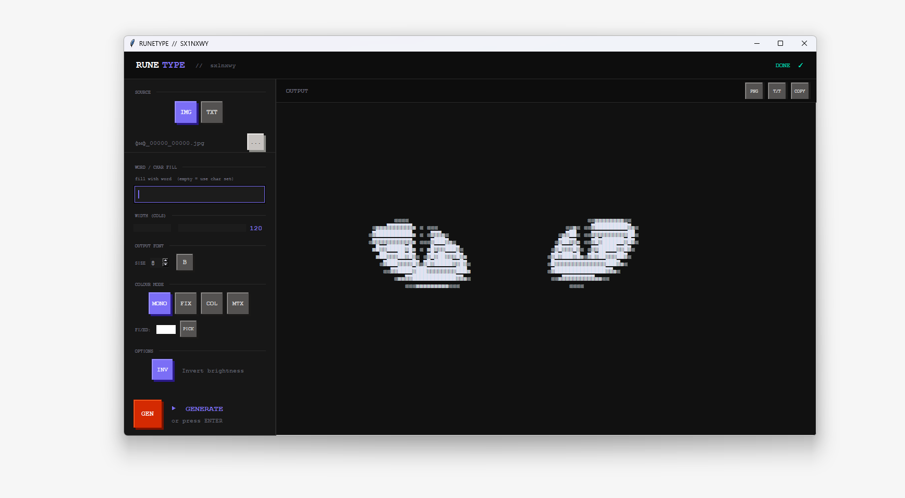
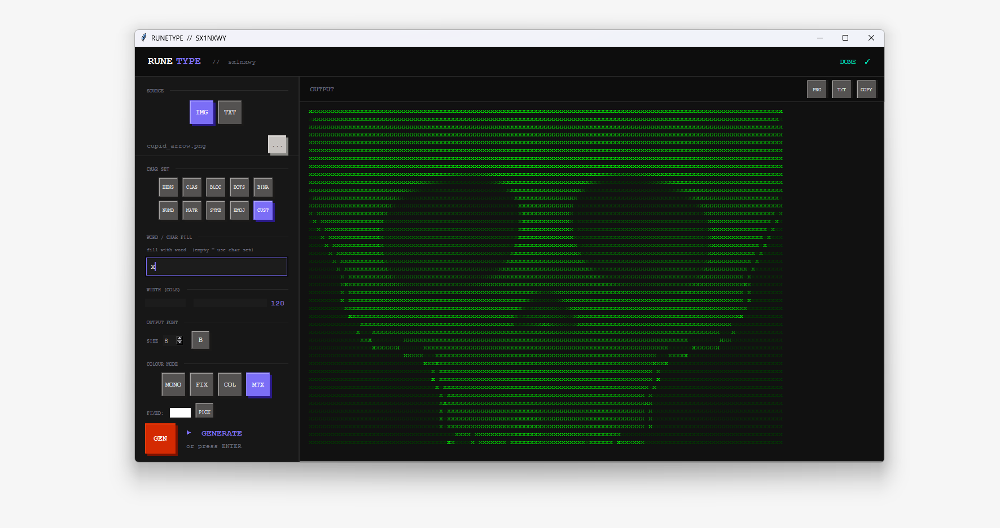
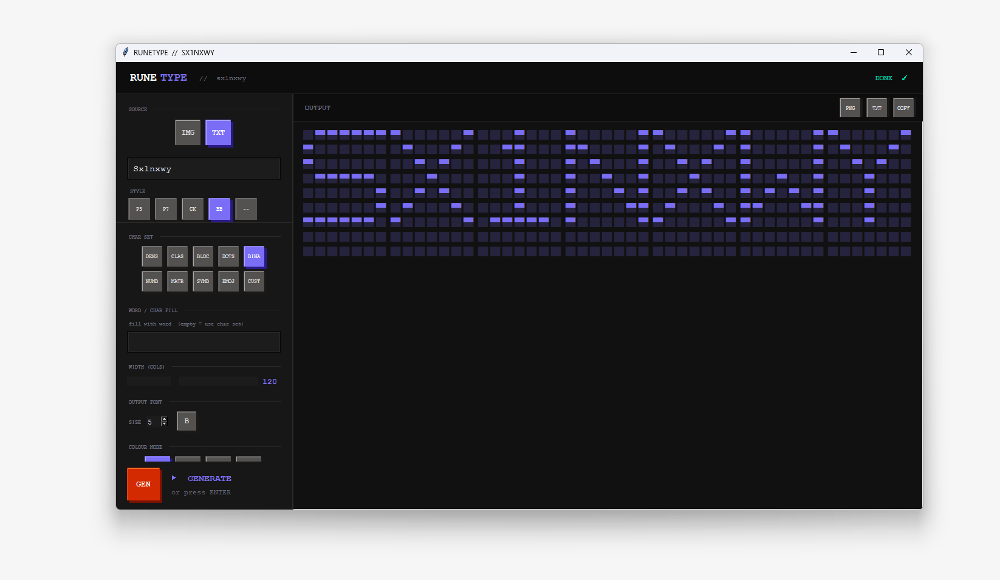
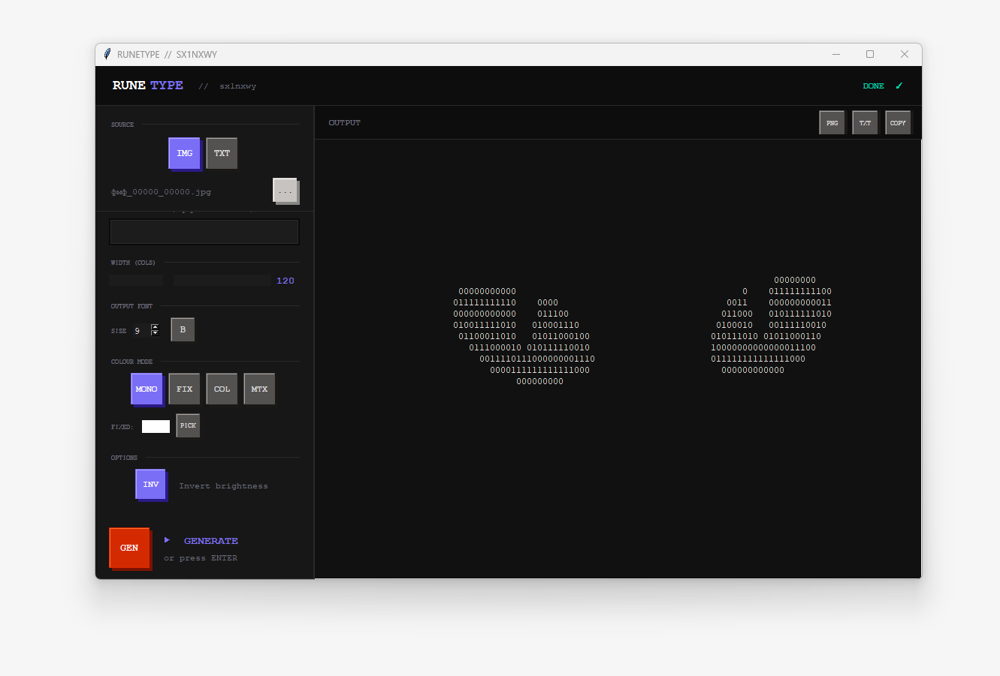

# RUNETYPE

```
██████╗ ██╗   ██╗███╗   ██╗███████╗████████╗██╗   ██╗██████╗ ███████╗
██╔══██╗██║   ██║████╗  ██║██╔════╝╚══██╔══╝╚██╗ ██╔╝██╔══██╗██╔════╝
██████╔╝██║   ██║██╔██╗ ██║█████╗     ██║    ╚████╔╝ ██████╔╝█████╗  
██╔══██╗██║   ██║██║╚██╗██║██╔══╝     ██║     ╚██╔╝  ██╔═══╝ ██╔══╝  
██║  ██║╚██████╔╝██║ ╚████║███████╗   ██║      ██║   ██║     ███████╗ 
╚═╝  ╚═╝ ╚═════╝ ╚═╝  ╚═══╝╚══════╝   ╚═╝      ╚═╝   ╚═╝     ╚══════╝
```

> **ASCII art generator** — convert images and text into ASCII/block art.  
> Teenage Engineering EP-133 inspired UI. Built with Python + Tkinter.

---

## Features

- **Image → ASCII** — load any photo, render it as characters
- **Text → pixel font** — 5 styles: Pixel, Wide, Chunky, BigBlock, Plain
- **Word/char fill** — fill your image with a specific word or symbol
- **9 char sets** — Dense, Classic, Blocks, Binary, Matrix, Emoji and more
- **Color modes** — Mono / Fixed color / Original color / Matrix green
- **Export PNG** — 2K quality output with correct proportions
- **Export TXT** — raw ASCII text

---

## Download

| Platform | Link |
|----------|------|
| **Windows (.exe)** | [Latest Release →](../../releases/latest) |
| **Python (all platforms)** | `pip install pillow` then `python ascii_gen.py` |

---

## Screenshots






---

## Run from source

```bash
pip install pillow
python ascii_gen.py
```

---

## Build .exe yourself

```
pip install pyinstaller
pyinstaller --onefile --noconsole --name runetype ascii_gen.py
```

---

## License

MIT — do whatever you want with it.

---

*made by [sx1nxwy](https://github.com/Sx1nxwyo)*
